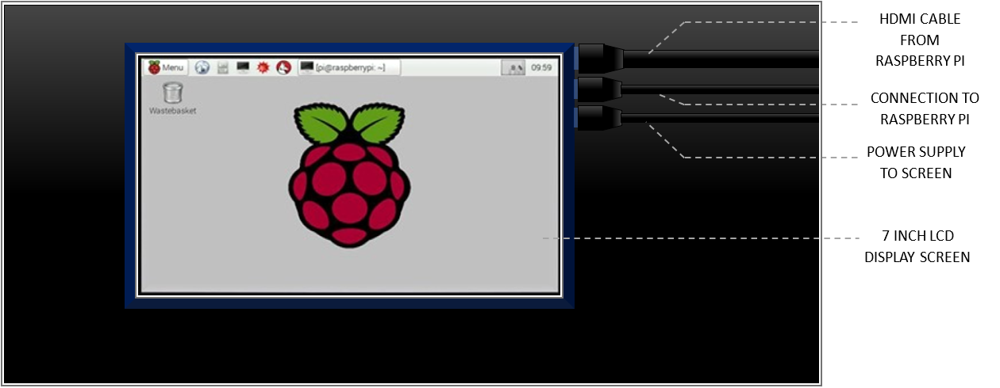
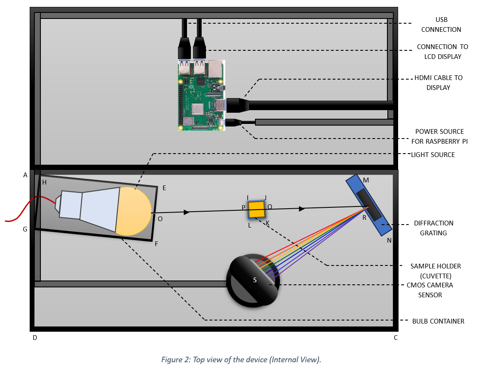
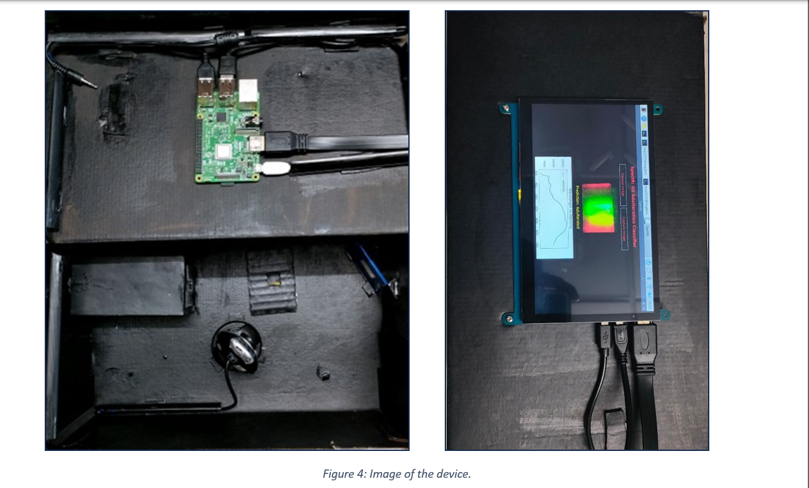

# Transformer Oil Ageing Detection
### Using a Self-Powered, Portable, Low-Cost Spectrophotometer with Wireless Data Transfer

## 📌 Overview
This project presents a **low-cost, portable spectrophotometer** designed to detect **transformer oil ageing** 
This device offers a **cost-efficient, self-powered solution** with the ability to transfer captured spectral images wirelessly using **Firebase Cloud**.

Key features include:
- Portable and rechargeable device with **low-battery indicator**
- **On-device testing** with real-time spectrum analysis
- **Wireless data transfer** via Raspberry Pi + Firebase
- Integration with **Deep Learning models** for impurity classification
- GUI support for **remote monitoring and prediction**

---

## 🛠️ Hardware Components
| Sl. No. | Component             | Specification                          |
|---------|----------------------|----------------------------------------|
| 1       | Casing               | 338×193×125 mm                         |
| 2       | Light Source         | 9-Watt Rechargeable White LED          |
| 3       | Cuvette              | 12×12×45 mm                            |
| 4       | Diffraction Grating  | 15000 LPI                              |
| 5       | CMOS Camera          | 640×480, 30 FPS, USB                   |
| 6       | Processing Unit      | Raspberry Pi 3B                        |
| 7       | LCD Display          | 7 inch                                 |
| 8       | Voltage Regulator IC | Standard IC XXXX                       |

  

---

## ⚙️ Device Workflow
1. **Light Interaction:**  
   White LED light passes through a slit and the oil sample in a cuvette.  
   Transmission varies with impurity levels (Beer-Lambert Law).

2. **Spectral Capture:**  
   Transmitted light passes through a diffraction grating and is recorded by a CMOS camera.

3. **Data Transfer:**  
   Spectrum image is sent to Raspberry Pi → uploaded to **Firebase Cloud Storage**.

4. **Remote Access & Analysis:**  
   Authorized users can download spectrum images, plot **Intensity vs Wavelength**, and run ML-based impurity detection.

5. **AI/ML Model:**  
   - **CNN-based classifier** for impurity detection & quantification (multi-class).  
   - **TinyML (tflite) model** for on-device binary classification (Pure vs Adulterated).

       
      
     

---

## 🧑‍💻 Software Stack
- **Python**: OpenCV, NumPy, Matplotlib, Pandas
- **Firebase (Pyrebase)**: Remote storage & authentication
- **TensorFlow/Keras**: CNN-based classification model
- **Tkinter**: GUI for remote interaction
- **TinyML (TFLite)**: On-device model deployment

---

## 📊 Results
- Achieved **~99.3% test accuracy** on CNN model.  
- GUI enables easy interaction, displaying:  
  - Spectrum Image  
  - Intensity vs Wavelength Plot  
  - Predicted Class ('Fresh', 'Highly Aged', 'Lightly Aged', 'Moderately Aged')

---

## 📷 Device Layout
- **External View:** Portable casing with 7-inch LCD  
- **Internal View:** Light source, cuvette, grating, CMOS camera  
- **GUI:** Local + Remote interfaces for results visualization  

---

## 🚀 Future Improvements
- Extend detection to other edible oils & impurities  
- Add mobile app integration for easier remote access  
- Miniaturization for consumer-level adoption  

---

